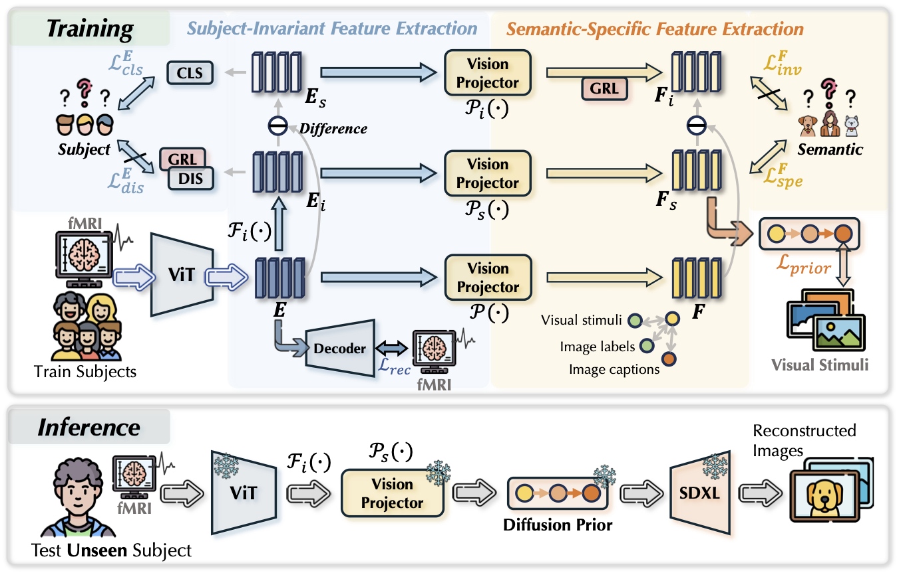
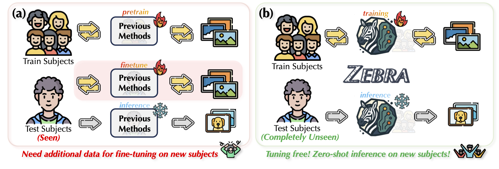

# **[NeurIPS 2025]** <span style="font-variant: small-caps;">Zebra</span>: Towards Zero-Shot Cross-Subject Generalization for Universal Brain Visual Decoding 

<div align="center">

[](https://arxiv.org/abs/2510.27128)
<!--
[](https://huggingface.co/McGregorW/NEURONS)
-->

🌟 **If you find our project useful, please consider giving us a star!** ⭐

</div>


## 📌 Overview


<div align="center">



*Architecture of the <span style="font-variant: small-caps;">Zebra</span> framework*

</div>


Recent advances in neural decoding have enabled the reconstruction of visual experiences from brain activity, positioning fMRI-to-image reconstruction as a promising bridge between neuroscience and computer vision. However, current methods predominantly rely on subject-specific models or require subject-specific fine-tuning, limiting their scalability and real-world applicability. In this work, we introduce <span style="font-variant: small-caps;">Zebra</span>, the first zero-shot brain visual decoding framework that eliminates the need for subject-specific adaptation. <span style="font-variant: small-caps;">Zebra</span> is built on the key insight that fMRI representations can be decomposed into subject-related and semantic-related components. By leveraging adversarial training, our method explicitly disentangles these components to isolate subject-invariant, semantic-specific representations. This disentanglement allows <span style="font-variant: small-caps;">Zebra</span> to generalize to unseen subjects without any additional fMRI data or retraining.


<div align="center">



*Comparison between previous methods and <span style="font-variant: small-caps;">Zebra</span>*

</div>


## 📣 Latest Updates


🟡 2025/11 &nbsp;&nbsp; Code released!

🟡 2025/09 &nbsp;&nbsp; **_ZEBRA_** is accepted by NeurIPS-2025!


## 🛠️ Installation & Setup


### 🖥️ Environment Setup


```bash
conda create -n zebra python==3.10
conda activate zebra
pip install torch==2.1.0 torchvision==0.16.0 torchaudio==2.1.0 --index-url https://download.pytorch.org/whl/cu118
pip install -r requirements.txt
```


### 📊 Data Preparation

Download the pre-processed dataset:

```bash
python download_dataset.py
unzip fmri_npy.zip
unzip nsddata_stimuli.zip
```


## 🚀 Quick Start
This codebase allows train, test, and evaluate using one single bash file.

```
bash run.sh 0 zebra 1234567 1 1 last
```


------
Parameters:

`$1`: use which gpu to train

`$2`: train file postfix, e.g, `zebra`

`$3`: run which stage: `1234567` for the whole process, `34567` for test & eval only

- `1`: train brain model
- `2`: train prior network
- `3`: image reconstruction
- `4`: evaluation with all metrics
- `5`: caption the keyframes with BLIP-2
- `6`: enhanced image reconstruction
- `7`: final evaluation with all metrics

`$4`: unseen subject (use others for training): `[1,2,5,7]`

`$5`: use which ckpt for inference: `['last', 'prior']`


----
Note that for convenience of debugging, `use_wandb` is set to `False` be default. 

If you would like to use wandb, first run `wandb login` and set the `use_wandb` to `True` in `train_zebra.py`.


## 📚 Citation

If you find this project useful, please consider citing:

```bibtex
@article{wang2025zebra,
  title={ZEBRA: Towards Zero-Shot Cross-Subject Generalization for Universal Brain Visual Decoding},
  author={Wang, Haonan and Lu, Jingyu and Li, Hongrui and Li, Xiaomeng},
  journal={arXiv preprint arXiv:2510.27128},
  year={2025}
}
```
